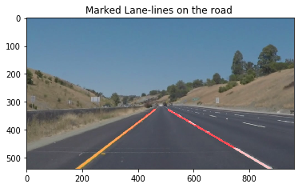

# Project 1: Finding Lane Lines on the Road

## Overview
This first project of Udacity's SDCND is to recognize lane-lines on a freeway in a video and overlay them with a continuous (red or any preferred color) line using computer vision techniques. The computer vision techniques were applied by using the Open Computer Vision (OpenCV) library. The project was written in Python.  




#### My conda environment file

```
    conda env create -f proj1_environment.yml

```

#### Code

You can checkout the project code using this [jupyter notebook](./P1.ipynb)

A brief report of the project can be found here: [Writeup_report](./writeup_report.md)

